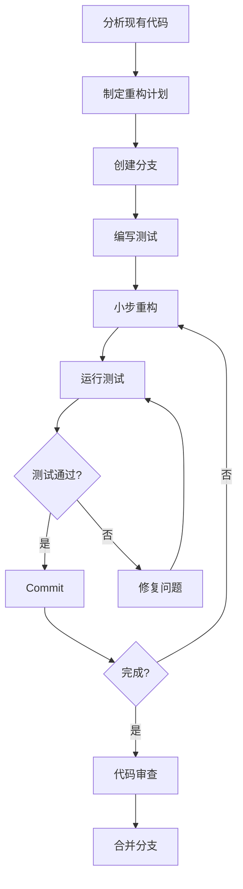

# 后端重构经验总结

本文档总结了 QIM 项目后端重构的核心经验和最佳实践，用于指导未来的重构工作。

## 一、分层架构重构

### 1.1 标准分层结构

```
Handler 层 (路由处理)
    ↓ 调用
Service 层 (业务逻辑)
    ↓ 调用
Repository 层 (数据访问)
    ↓ 调用
Database (数据库)
```

### 1.2 各层职责

| 层级 | 职责 | 不应包含 |
|------|------|---------|
| **Handler** | 参数校验、请求解析、响应格式化 | 业务逻辑、数据库操作 |
| **Service** | 业务规则、事务管理、跨模块协调 | HTTP 相关代码、SQL 语句 |
| **Repository** | CRUD 操作、查询构建、数据映射 | 业务逻辑、HTTP 响应 |

### 1.3 重构步骤

1. **识别现有代码边界**：找出混杂的业务逻辑和数据访问代码
2. **创建 Service 接口**：定义业务方法签名
3. **迁移业务逻辑**：从 Handler 移到 Service
4. **创建 Repository**：封装数据库操作
5. **更新 Handler**：仅保留参数解析和响应格式化
6. **添加测试**：每层独立测试

## 二、统一响应格式

### 2.1 标准响应结构

```go
type Response struct {
    Code    int         `json:"code"`
    Message string      `json:"message"`
    Data    interface{} `json:"data,omitempty"`
}
```

### 2.2 响应函数映射

| 场景 | 函数 | HTTP 状态码 | 业务码 |
|------|------|------------|--------|
| 成功 | `response.Success(c, data)` | 200 | 0 |
| 成功带消息 | `response.SuccessWithMessage(c, msg, data)` | 200 | 0 |
| 参数错误 | `response.BadRequest(c, msg)` | 400 | 10001 |
| 未认证 | `response.Unauthorized(c, msg)` | 401 | 10002 |
| 无权限 | `response.Forbidden(c, msg)` | 403 | 10003 |
| 不存在 | `response.NotFound(c, msg)` | 404 | 10004 |
| 冲突 | `response.Conflict(c, msg)` | 409 | 10005 |
| 服务器错误 | `response.InternalServerError(c, msg)` | 500 | 10006 |
| 请求过多 | `response.TooManyRequests(c, msg)` | 429 | 10007 |

### 2.3 重构检查清单

- [ ] 所有 Handler 使用 `response` 包函数
- [ ] 无直接 `c.JSON()` 调用
- [ ] 错误码使用常量而非硬编码
- [ ] 成功响应包含 `data` 字段（即使为 nil）
- [ ] 前端 `ApiResponse` 接口与后端一致

## 三、错误码体系

### 3.1 错误码设计原则

```go
// 基础错误码 (0-999)
const (
    ErrCodeSuccess          = 0     // 成功
    ErrCodeInvalidParams    = 10001 // 参数错误
    ErrCodeUnauthorized     = 10002 // 未认证
    ErrCodeForbidden        = 10003 // 无权限
    ErrCodeNotFound         = 10004 // 不存在
    ErrCodeConflict         = 10005 // 冲突
    ErrCodeInternalError    = 10006 // 服务器错误
    ErrCodeTooManyRequests  = 10007 // 请求过多
)

// 业务错误码 (按模块分段)
const (
    ErrCodeUserBase      = 20000 // 用户模块
    ErrCodeMessageBase   = 30000 // 消息模块
    ErrCodeGroupBase     = 40000 // 群组模块
    ErrCodeAIBase        = 50000 // AI 模块
)
```

### 3.2 BusinessError 结构

```go
type BusinessError struct {
    Code    int
    Message string
}

func (e *BusinessError) Error() string {
    return e.Message
}
```

### 3.3 错误处理最佳实践

1. **Service 层返回 BusinessError**：携带业务错误码
2. **Handler 层使用 FromBusinessError**：自动映射 HTTP 状态码
3. **避免错误信息泄露**：生产环境不返回详细堆栈
4. **日志记录完整信息**：Debug 级别记录完整错误上下文

## 四、依赖注入

### 4.1 DI 容器结构

```go
type Container struct {
    DB       *gorm.DB
    Config   *config.Config
    
    // Repositories
    UserRepository    repository.UserRepository
    MessageRepository repository.MessageRepository
    
    // Services
    UserService    service.UserService
    MessageService service.MessageService
    
    // Handlers
    UserHandler    handler.UserHandler
    MessageHandler handler.MessageHandler
}
```

### 4.2 注入原则

| 原则 | 说明 |
|------|------|
| **构造函数注入** | 通过构造函数传递依赖，而非全局变量 |
| **接口依赖** | 依赖接口而非具体实现，便于测试和替换 |
| **单一职责** | 每个组件只关注自己的职责 |
| **生命周期管理** | 容器负责组件的初始化和清理 |

### 4.3 重构步骤

1. **识别全局变量**：找出所有 `var` 声明的全局依赖
2. **创建接口**：为每个依赖定义接口
3. **修改构造函数**：添加依赖参数
4. **更新调用方**：通过容器获取依赖
5. **删除全局变量**：移除旧的 `var` 声明
6. **验证测试**：确保所有测试通过

## 五、测试策略

### 5.1 分层测试

| 层级 | 测试类型 | 重点 | Mock 对象 |
|------|---------|------|----------|
| **Repository** | 单元测试 | CRUD 操作、查询逻辑 | 数据库 |
| **Service** | 单元测试 | 业务规则、事务 | Repository |
| **Handler** | 集成测试 | 参数校验、响应格式 | Service |

### 5.2 测试模板

```go
func TestService_Method(t *testing.T) {
    // Given - 准备测试数据和 Mock
    mockRepo := &MockRepository{}
    service := NewService(mockRepo)
    
    // When - 执行测试
    result, err := service.Method(input)
    
    // Then - 验证结果
    assert.NoError(t, err)
    assert.Equal(t, expected, result)
    mockRepo.AssertCalled(t, "ExpectedMethod", expectedArgs)
}
```

### 5.3 测试覆盖率目标

- Repository 层：≥ 80%
- Service 层：≥ 70%
- Handler 层：≥ 60%

## 六、前后端兼容性

### 6.1 兼容性检查清单

重构前后端接口时，必须检查：

- [ ] 响应字段名称不变
- [ ] 响应字段类型不变
- [ ] 错误码含义一致
- [ ] 分页格式一致 (list/total)
- [ ] 日期格式一致
- [ ] 空值处理一致 (null vs 空数组)

### 6.2 前端适配模式

```typescript
// 标准响应处理
interface ApiResponse<T> {
  code: number
  message: string
  data: T
}

// 列表响应
interface ListResponse<T> {
  list: T[]
  total: number
}

// 使用示例
const res = await api.get<ListResponse<User>>('/users')
users.value = res.data.data.list
pagination.total = res.data.data.total
```

## 七、重构流程

### 7.1 标准重构流程



### 7.2 小步重构原则

1. **每次只改一件事**：不要同时重构多个模块
2. **保持可运行状态**：每次 commit 后代码应该能编译运行
3. **频繁提交**：每完成一个小步骤就 commit
4. **随时可回滚**：如果发现问题，能快速回退

### 7.3 重构检查点

| 阶段 | 检查项 |
|------|--------|
| **开始前** | 现有测试全部通过、代码已提交 |
| **进行中** | 每步完成后测试通过、编译成功 |
| **完成后** | 所有测试通过、代码审查通过、性能无退化 |

## 八、常见陷阱

### 8.1 避免的陷阱

| 陷阱 | 表现 | 解决方案 |
|------|------|---------|
| **大爆炸重构** | 一次性修改太多文件 | 小步重构，频繁提交 |
| **忽略测试** | 重构后不运行测试 | TDD，先写测试再重构 |
| **过度设计** | 引入不必要的抽象层 | YAGNI 原则，按需抽象 |
| **破坏兼容性** | 修改接口导致前端报错 | 前后端联调验证 |
| **遗漏清理** | 保留废弃代码和全局变量 | 重构完成后彻底清理 |

### 8.2 代码质量指标

重构后应达到的标准：

- ✅ 无全局变量
- ✅ 统一响应格式
- ✅ 统一错误码
- ✅ 依赖注入
- ✅ 测试覆盖率达标
- ✅ 无重复代码
- ✅ 清晰的职责划分

## 九、工具与脚本

### 9.1 常用命令

```bash
# 编译检查
go build ./...

# 运行测试
go test ./... -v -cover

# 查看测试覆盖率
go test ./... -coverprofile=coverage.out
go tool cover -html=coverage.out

# 代码格式化
go fmt ./...

# 静态分析
golangci-lint run
```

### 9.2 批量替换脚本

```bash
# 查找所有 c.JSON 调用
grep -rn "c\.JSON(" handler/

# 查找所有全局变量
grep -rn "^var " service/ repository/

# 查找未使用 response 包的文件
grep -L "response\." handler/*.go
```

## 十、经验教训

### 10.1 成功要素

1. **充分的测试覆盖**：没有测试的重构是危险的
2. **清晰的职责划分**：每层只做自己的事
3. **统一的编码规范**：团队遵循相同的标准
4. **渐进式重构**：小步快跑，不要大爆炸
5. **前后端协同**：接口变更必须联调验证

### 10.2 失败教训

1. **忽视兼容性**：修改响应格式导致前端报错
2. **过度抽象**：为了抽象而抽象，增加复杂度
3. **缺乏文档**：重构后没有更新文档
4. **跳过审查**：没有代码审查就合并
5. **忽略性能**：重构后性能退化

---

> **维护说明**：本文档应随项目演进而持续更新，每次重大重构后补充经验教训。