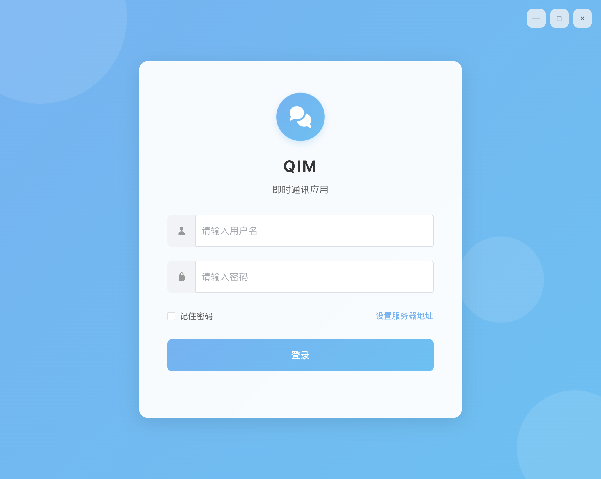
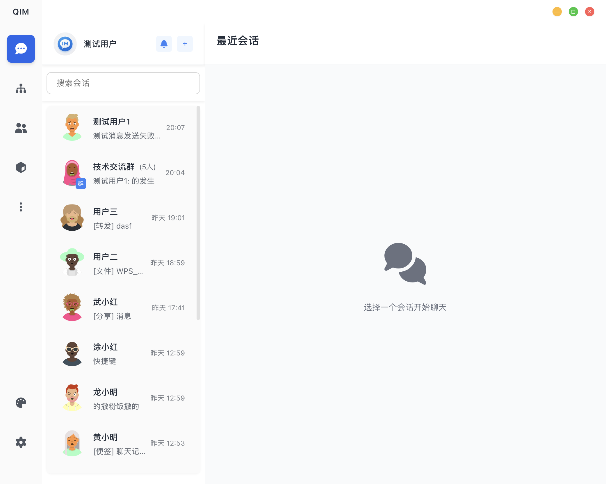
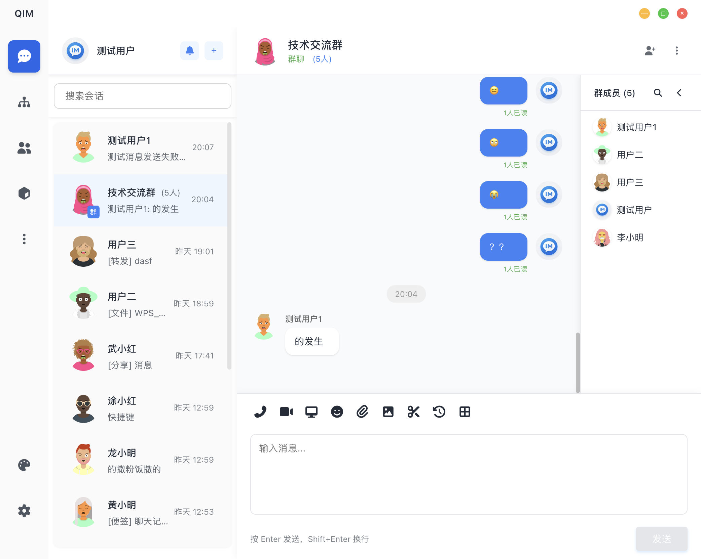
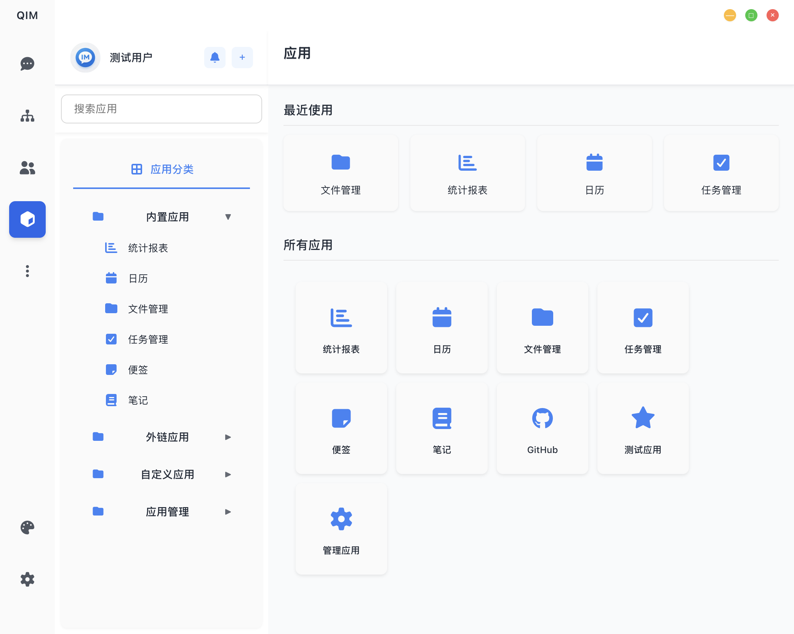

# QIM - 企业即时通讯系统

<!-- badges -->

[](https://github.com/qim/im)
[](https://github.com/qim/im)
[](LICENSE)

***

## 📖 产品简介

**QIM (Quick Instant Messaging)** 是一款面向企业的即时通讯解决方案，基于 Vue 3 + Electron 构建，支持 macOS、Windows、Linux 多平台运行。

QIM 提供完整的即时通讯功能，包括单聊、群聊、讨论组、频道等，同时集成了任务管理、日历、笔记、文件管理等办公应用，为企业团队协作提供一站式解决方案。

***

## ✨ 核心特性

### 即时通讯

| 特性          | 说明                     |
| ----------- | ---------------------- |
| 🔐 **单聊**   | 加密私聊，支持文本、图片、文件等多种消息类型 |
| 👥 **群聊**   | 支持创建群聊、邀请成员、设置管理员      |
| 💬 **讨论组**  | 扁平化讨论，所有成员平等参与         |
| 📢 **频道**   | 订阅制信息发布，适合公告、通知场景      |
| ✉️ **消息引用** | 回复指定消息，上下文清晰           |
| 🔄 **消息撤回** | 2分钟内可撤回，误发无忧           |
| 🔍 **消息搜索** | 支持关键词、日期、类型筛选          |
| ✅ **已读回执**  | 群聊显示已读人数，单聊显示已读状态      |

### 消息类型

- 📝 **文本消息** - 支持 URL 自动识别和链接转换
- 🖼️ **图片消息** - 支持大图预览
- 📎 **文件消息** - 支持下载、另存为
- 🔗 **分享消息** - 分享笔记、便签、文件
- 📱 **小程序卡片** - 小程序信息展示
- 📰 **资讯卡片** - 新闻链接展示

### 应用中心

| 应用          | 说明                 |
| ----------- | ------------------ |
| 📊 **统计报表** | 消息趋势、文件分布、任务完成率可视化 |
| 📅 **日历**   | 月视图日历，事件管理，支持提醒    |
| 📝 **笔记**   | Markdown 编辑器，实时预览  |
| 📌 **便签**   | 快捷笔记，支持多色分类        |
| 📁 **文件管理** | 文件上传、下载、分级管理       |
| ✅ **任务管理**  | 看板视图，待办/进行中/已完成    |

### 组织架构

- 🏢 **树形组织** - 多级部门展示
- 👤 **员工信息** - 头像、姓名、职位、部门
- 🔍 **快速搜索** - 搜索用户或部门
- 💬 **一键私聊** - 双击用户直接发起私聊

### 安全特性

- 🔑 **JWT 认证** - 无状态安全认证
- 🔐 **双因素认证** - 额外安全保护（可选）
- 📝 **登录日志** - 记录登录 IP、操作系统、版本
- 🚪 **会话管理** - 置顶、免打扰、移除

***

## 🖼️ 界面预览

### 登录界面



> 现代化的登录界面，支持记住密码、服务器地址配置

### 主界面



> 左侧边栏：最近联系人、组织架构、群聊、应用中心
> 右侧主区域：聊天窗口，支持消息发送、群成员列表

### 消息功能



> 支持多种消息类型：文本、图片、文件、分享、引用回复

### 应用中心



> 集成了统计报表、日历、笔记、便签、文件管理、任务管理

***

## 🏗️ 技术架构

### 前端技术栈

| 技术           | 说明                  |
| ------------ | ------------------- |
| Vue 3        | 渐进式 JavaScript 框架   |
| TypeScript   | 类型安全的 JavaScript 超集 |
| Element Plus | 桌面端 UI 组件库          |
| Vite         | 下一代前端构建工具           |
| Electron     | 跨平台桌面应用框架           |
| Axios        | HTTP 请求库            |
| Font Awesome | 图标库                 |

### 后端技术栈

| 技术                | 说明                |
| ----------------- | ----------------- |
| Go                | 高性能编译型语言          |
| Gin               | 高性能 HTTP Web 框架   |
| GORM              | Go 语言 ORM 库       |
| Gorilla WebSocket | WebSocket 实现      |
| SQLite            | 轻量级关系数据库          |
| JWT               | JSON Web Token 认证 |

### 系统架构图

```
┌─────────────────────────────────────────────────────────────┐
│                        客户端                                │
│  ┌─────────┐  ┌─────────┐  ┌─────────┐  ┌─────────┐        │
│  │ macOS   │  │Windows  │  │ Linux   │  │ Web     │        │
│  │Electron │  │Electron │  │Electron │  │ Browser │        │
│  └────┬────┘  └────┬────┘  └────┬────┘  └────┬────┘        │
└───────┼────────────┼────────────┼────────────┼──────────────┘
        │            │            │            │
        └────────────┴─────┬──────┴────────────┘
                           │
                    HTTP / WebSocket
                           │
┌──────────────────────────┼──────────────────────────────────┐
│                     API Gateway                              │
│                      localhost:8080                          │
│  ┌─────────────────────────────────────────────────────┐     │
│  │                    Gin Router                        │     │
│  │  ┌──────────┐ ┌──────────┐ ┌──────────┐            │     │
│  │  │ Auth     │ │ Message  │ │ User     │            │     │
│  │  │ Handler  │ │ Handler  │ │ Handler  │            │     │
│  │  └──────────┘ └──────────┘ └──────────┘            │     │
│  │  ┌──────────┐ ┌──────────┐ ┌──────────┐            │     │
│  │  │ Group    │ │ File     │ │ Note     │            │     │
│  │  │ Handler  │ │ Handler  │ │ Handler  │            │     │
│  │  └──────────┘ └──────────┘ └──────────┘            │     │
│  └─────────────────────────────────────────────────────┘     │
│                           │                                  │
│  ┌────────────────────────┼────────────────────────────────┐ │
│  │              WebSocket Hub                              │ │
│  │  ┌──────────┐ ┌──────────┐ ┌──────────┐               │ │
│  │  │ Register │ │ Broadcast│ │ SendTo   │               │ │
│  │  │ Client   │ │ Message  │ │ User     │               │ │
│  │  └──────────┘ └──────────┘ └──────────┘               │ │
│  └─────────────────────────────────────────────────────────┘ │
│                           │                                  │
└───────────────────────────┼──────────────────────────────────┘
                            │
              ┌─────────────┴─────────────┐
              │                           │
        ┌─────▼─────┐              ┌──────▼──────┐
        │  SQLite   │              │   Uploads   │
        │  Database │              │   Folder    │
        └───────────┘              └─────────────┘
```

***

## 📁 项目结构

```
im-ui/
├── qim-client/                 # 前端项目
│   ├── src/
│   │   ├── components/         # Vue 组件
│   │   │   ├── apps/          # 应用组件
│   │   │   │   ├── CalendarApp.vue
│   │   │   │   ├── FileManagementApp.vue
│   │   │   │   ├── NotesApp.vue
│   │   │   │   ├── StickyNotesApp.vue
│   │   │   │   ├── StatisticsApp.vue
│   │   │   │   └── TaskManagementApp.vue
│   │   │   ├── ChannelList.vue
│   │   │   ├── ChatWindow.vue
│   │   │   ├── Login.vue
│   │   │   ├── Main.vue
│   │   │   ├── NotificationCenter.vue
│   │   │   ├── ShareModal.vue
│   │   │   ├── Sidebar.vue
│   │   │   └── UserProfile.vue
│   │   ├── styles/            # 样式文件
│   │   ├── types/             # TypeScript 类型
│   │   ├── utils/             # 工具函数
│   │   ├── App.vue
│   │   └── main.ts
│   ├── electron/              # Electron 相关文件
│   │   ├── main.js           # 主进程
│   │   └── preload.js        # 预加载脚本
│   ├── package.json
│   └── vite.config.ts
│
├── qim-server/                # 后端项目
│   ├── config/               # 配置
│   │   └── config.go
│   ├── database/             # 数据库
│   │   └── database.go
│   ├── handler/              # 处理器
│   │   └── handler.go
│   ├── middleware/           # 中间件
│   │   └── auth.go
│   ├── model/                # 数据模型
│   │   └── model.go
│   ├── ws/                   # WebSocket
│   │   └── ws.go
│   ├── uploads/              # 上传文件目录
│   ├── main.go
│   └── go.mod
│
├── README.md                  # 项目说明
├── server-design.md          # 后端技术方案
└── 功能完善实施方案.md          # 功能完善计划
```

***

## 🚀 快速开始

### 环境要求

- Node.js >= 16.x
- Go >= 1.18
- npm 或 yarn

### 1. 启动后端服务

```bash
# 进入后端目录
cd qim-server

# 下载依赖
go mod download

# 启动服务
go run main.go
```

服务将在 `http://localhost:8080` 启动。

### 2. 启动前端开发服务器

```bash
# 新开终端，进入前端目录
cd qim-client

# 安装依赖
npm install

# 启动开发服务器
npm run dev
```

访问 `http://localhost:5173` 查看应用。

### 3. 打包桌面应用

```bash
cd qim-client

# 构建 Web 资源
npm run build

# 打包 Electron 应用
npm run electron:build
```

构建完成后，应用包位于 `qim-client/electron-dist/` 目录。

***

## 📖 使用指南

### 登录

1. 启动应用后，输入用户名和密码
2. 可选：勾选"记住密码"下次自动登录
3. 点击"登录"按钮进入主界面

### 发起聊天

**发起单聊：**

1. 在左侧栏选择"组织架构"
2. 找到目标用户，双击或点击"发起私聊"
3. 在聊天窗口发送消息

**创建群聊：**

1. 点击左侧栏的"+"按钮
2. 选择"创建群聊"
3. 输入群名称，添加群成员
4. 点击"创建"

### 使用应用

1. 在左侧栏选择"应用"
2. 选择要使用的应用（统计报表、日历、笔记等）
3. 在右侧区域进行操作

### 使用 AI 助手

1. 在左侧栏选择"应用"
2. 选择"AI 助手"应用
3. 在机器人列表中选择一个机器人
4. 在聊天窗口中输入消息，与机器人进行对话
5. 点击"返回"按钮退出 AI 助手

### 分享内容

1. 在笔记、便签或文件中找到要分享的内容
2. 点击"分享"按钮
3. 选择分享到的用户或群聊
4. 确认发送

***

## ⚙️ 配置说明

### 服务器配置

前端默认连接 `http://localhost:8080`，可在登录界面点击"设置服务器地址"修改。

### 端口配置

后端默认端口为 `8080`，如需修改请编辑 `qim-server/config/config.go`。

***

## 🔮 功能规划

### 近期计划

- [ ] 深色模式支持
- [ ] 消息表情反应
- [ ] 消息转发功能
- [ ] @提及功能
- [ ] 键盘快捷键
- [ ] 移动端适配

### 中期计划

- [ ] 语音/视频通话 (WebRTC)
- [ ] 表情包商店
- [ ] 消息漫游（多端同步）
- [ ] 离线消息推送
- [ ] 敏感词过滤

### 远期计划

- [ ] 视频会议
- [ ] AI 助手集成
- [ ] 企业微信/钉钉集成
- [ ] 低代码定制平台

***

## 🐛 已知问题

1. 深色模式 UI 未实现，仅有入口
2. 双因素认证后端验证为模拟实现
3. 移动端适配未完成

***

## 🤝 贡献指南

欢迎提交 Issue 和 Pull Request！

***

## 📄 许可证

MIT License

***

## 📞 联系方式

- 项目主页: <https://github.com/qim/im>
- 问题反馈: <https://github.com/qim/im/issues>

***

<p align="center">
  <strong>QIM - 让沟通更简单，让协作更高效</strong>
</p>
