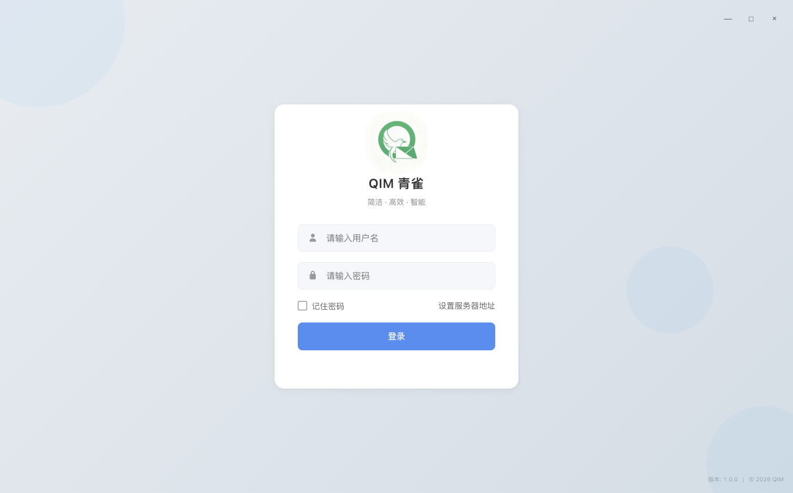
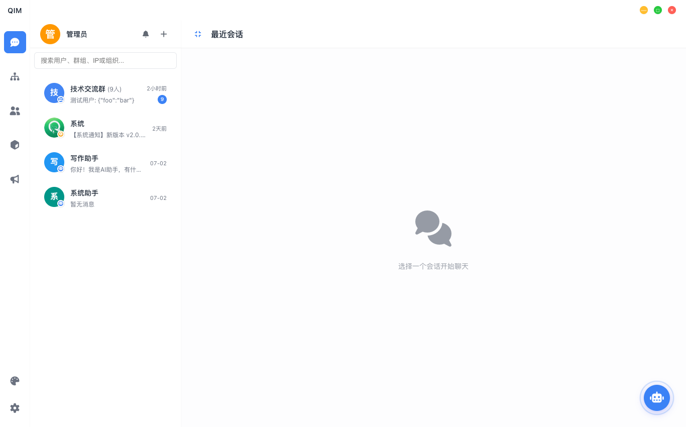
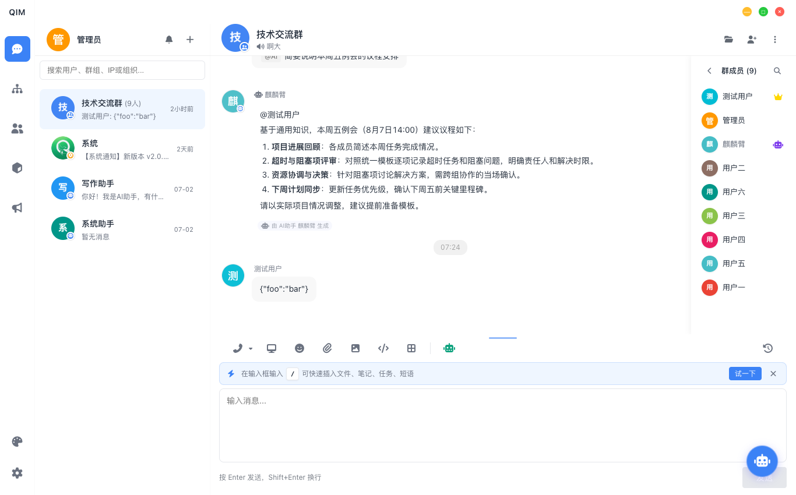
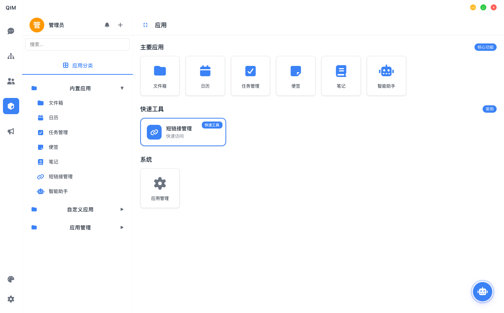

# QIM - 企业即时通讯系统 / Enterprise Instant Messaging

<!-- badges -->

> **QIM (Quick Instant Messaging) / 青雀** — 一款面向企业的即时通讯解决方案。

[](https://github.com/qim/im)
[](https://github.com/qim/im)
[](LICENSE)

***

## 📖 产品简介 / Introduction

**QIM (Quick Instant Messaging)** 是一款面向企业的即时通讯解决方案，基于 **Vue 3 + Electron + Go** 构建，支持 macOS、Windows、Linux 多平台运行。当前处于 **v2.0** 迭代阶段。

QIM 提供完整的即时通讯功能（单聊、群聊、讨论组、频道），集成了任务管理、日历、笔记、便签、文件管理等办公应用，深度整合 **AI** 能力（AI 助手、群聊助手、AI 分身与知识库），并配备独立的管理后台。同时对外提供 **Bot / Webhook / QIM CLI / MCP Server** 等生态接口，支持与外部 Agent 交互闭环。

> _QIM (Quick Instant Messaging) is an enterprise messaging solution built on Vue 3 + Electron + Go, running on macOS, Windows and Linux. It provides full IM features plus workplace apps (tasks, calendar, notes, sticky notes, files), deeply integrated AI capabilities, an admin console, and an open ecosystem (Bot, Webhook, CLI, MCP) for interoperation with external agents._

***

## ✨ 核心特性 / Core Features

### 即时通讯 / Instant Messaging

| 特性 | 说明 | Feature |
| --- | --- | --- |
| 🔐 **单聊** | 加密私聊，支持文本、图片、文件等多种消息类型 | Private DMs |
| 👥 **群聊** | 创建群聊、邀请成员、设置管理员、群主保护 | Group chats |
| 💬 **讨论组** | 扁平化讨论，所有成员平等参与 | Discussions |
| 📢 **频道** | 订阅制信息发布，富文本 Markdown 渲染、审批机制 | Channels (subscription feed) |
| ✉️ **消息引用/回复** | 回复指定消息，上下文清晰 | Quoted replies |
| 🔄 **消息撤回/编辑** | 2 分钟内撤回，撤回后可重新编辑回填 | Recall / re-edit |
| 🔍 **消息搜索/漫游** | 关键词、日期、类型筛选，多端同步 | Search & sync |
| ✅ **已读回执** | 群聊显示已读人数，单聊显示已读状态 | Read receipts |
| ⏰ **待办提醒** | 任务/事件定时触发通知 | Scheduled reminders |
| 🗣️ **语音/视频** | WebRTC 音视频通话、屏幕共享 | Voice / video / screen share |

### 消息类型 / Message Types

- 📝 **文本消息** — URL 自动识别与链接转换 · Text with auto-link
- 🖼️ **图片消息** — 大图预览 · Images with preview
- 📎 **文件消息** — 下载、另存 · Files
- 🔗 **分享消息** — 笔记、便签、文件分享 · Shared content
- 📱 **小程序卡片** · Mini-app cards
- 📰 **资讯卡片** · Article cards
- 🤖 **Bot 卡片** — 卡片动作、状态回写 · Bot cards (actions + state)

### 应用中心 / Workplace Apps

| 应用 | 说明 | App |
| --- | --- | --- |
| 📊 **统计报表** | 消息趋势、文件分布、任务完成率可视化 | Analytics |
| 📅 **日历** | 月视图日历，事件管理，支持提醒 | Calendar |
| 📝 **笔记** | Markdown 编辑器，实时预览 | Notes |
| 📌 **便签** | 快捷笔记，多色分类 | Sticky notes |
| 📁 **文件管理** | 个人文件、**群文件空间**、上传下载、分级权限 | File manager + group file space |
| ✅ **任务管理** | 看板视图，待办/进行中/已完成 | Tasks (kanban) |
| 🤖 **AI 助手** | 智能对话机器人交互 | AI assistant |
| 🔗 **短链接** | URL 缩短与管理 | Short links |

### 🤖 AI 能力 / AI Capabilities

> 基于 Cloudwego **Eino** 框架，多模型适配，支持流式对话与「思考中」状态。

- **多模型支持** — OpenAI、Claude(Anthropic)、通义千问、文心一言、腾讯混元等多个大模型
- **AI 助手** — 智能对话机器人，4xx 快速失败、合理重试
- **群聊 AI 助手** — 群级记忆（GroupMemoryService）、@ 触发、关键词门控、代管成员
- **AI 分身 / Avatar** — AI 生成虚拟形象、分身记忆、知识库（记忆+笔记）、触发决策、手动接管
- **知识库** — 向量检索（CortexDB / Gracedb），群文档、公共文档管理
- **智能摘要** — AI 自动生成消息摘要
- **智能搜索** — AI 驱动的语义搜索
- **群聊助手工具** — 便捷操作与工具调用

### 🔌 外部 Agent 生态 / Agent Ecosystem

- **Bot 消息闭环** — 外部 Agent ↔ QIM 用户消息互通，流式回复、卡片消息、卡片动作幂等、卡片状态回写
- **Webhook** — outbox 重试、死信兜底、投递监控、后台重投，支持纯 pull 模式
- **QIM CLI** — 登录、Token 自动续期、消息发送/流式 stdin、任务/事件创建、会话查询、JSON 输出、自动更新；跨平台、Makefile、服务端托管二进制
- **MCP Server (`qim-mcp`)** — 标准 MCP，stdio adapter + Streamable HTTP transport，对外暴露 IM 工具给 Claude/Cursor
- **qim-landing** — VitePress 官方落地页 / 文档站

### 🛡️ 安全特性 / Security

- 🔑 **JWT 认证** — 无状态安全认证
- 🔐 **双因素认证**（可选）· **登录日志** · **会话管理**（置顶/免打扰/隐藏）
- 🛡️ **黑名单管理** — 违规用户封禁与恢复
- 🚫 **敏感词过滤** · **权限校验** — 修复多处 IDOR、越权访问、敏感信息泄露风险
- 👥 **组织权限** — 群文件空间 scope 隔离、集中式文件权限校验
- 🔐 **密码安全** — 客户端记住密码用 Electron safeStorage 加密存储

### 🖥️ 管理后台 / Admin Console

| 模块 | 功能说明 | Module |
| --- | --- | --- |
| 📊 **仪表盘** | 系统运行概览、核心指标统计 | Dashboard |
| 👥 **用户管理** | 用户 CRUD、角色分配、状态管理 | Users |
| 🏢 **组织架构** | 部门树管理、员工分配 | Organization |
| 💬 **群组管理** | 群组查看、成员管理 | Groups |
| 🗨️ **会话管理** | 会话列表、详情 | Conversations |
| 📢 **频道管理** | 频道增删改查、订阅管理 | Channels |
| 📦 **应用管理** | 应用 CRUD、分类管理 | Apps |
| 📱 **小程序管理** | 小程序增删改查、配置管理 | Mini-apps |
| 📨 **系统消息** · 🔔 **通知管理** | 消息发送、通知模板 | System messages / Notifications |
| 🚫 **黑名单管理** | 黑名单查看、移出 | Blacklist |
| 📈 **数据统计** | 用户/群组/消息统计、趋势图表 | Statistics |
| 🤖 **AI 工具 / Bot 运维** | AI 工具注册表、Bot 列表、Webhook 投递监控、失败重投 | AI tools / Bot ops |
| 📚 **文档管理** | 公共文档、版本管理 | Documents |
| ⚙️ **参数配置** | 提醒门槛、重复冷却等可配置项 | Settings |

***

## 🖼️ 界面预览 / Screenshots

### 登录界面 / Login



> 现代化登录界面，支持记住密码（加密存储）、服务器地址配置

### 主界面 / Main



> 左侧边栏：最近联系人、组织架构、群聊、应用、频道；右侧主区域：会话列表与聊天窗口

### 消息功能 / Messages



> 打开会话后的聊天窗口：支持多种消息类型（文本、图片、文件、分享、引用回复），已读回执常驻

### 应用中心 / Apps



> 主要应用：文件箱、日历、任务管理、便签、笔记、智能助手、短链接管理

***

## 🏗️ 技术架构 / Tech Stack

| 层 | 技术 | Layer |
| --- | --- | --- |
| 桌面客户端 | **Vue 3 · TypeScript · Vite 5 · Electron 42 · Pinia · Element Plus** | Desktop client |
| 前端 Web | **Vue 3 · TypeScript · Vite 5 · Element Plus · ECharts** | Web / admin |
| 后端 API | **Go 1.25 · Gin · GORM** | Backend |
| 实时通信 | **Gorilla WebSocket** | Realtime |
| 数据库 | **SQLite**（默认） / **MySQL** | Database |
| 认证 | **JWT (golang-jwt v5)** · OAuth/CAS/LDAP | Auth |
| 文件存储 | **AWS S3 SDK v2**，分片上传 | Storage |
| AI 框架 | **Cloudwego Eino** + **CortexDB / Gracedb**（向量） | AI |
| 任务调度 | **robfig/cron** | Scheduling |
| 生态接口 | **QIM CLI (Cobra)** · **MCP Server** · **Webhook** | Ecosystem |

### 系统架构图 / Architecture

```
┌─────────────────────────────────────────────────────────────┐
│                         客户端 / Clients                     │
│  ┌─────────┐┌─────────┐┌─────────┐┌─────────┐┌──────────┐  │
│  │ macOS   ││Windows  ││ Linux   ││  Web    ││ QIM CLI  │  │
│  │Electron ││Electron ││Electron ││Admin/Web││/Bot/MCP  │  │
│  └────┬────┘└────┬────┘└────┬────┘└────┬────┘└────┬─────┘  │
└───────┼──────────┼──────────┼──────────┼──────────┼────────┘
        └──────────┴─────┬────┴────┬─────┴──────────┘
                         │         │
                  HTTP / WebSocket  (localhost:8080)
                         │         │
┌────────────────────────┼─────────┼──────────────────────────┐
│                      API Gateway (Gin)                      │
│  ┌────────────────────────────────────────────────────────┐ │
│  │  Auth · Message · User · Group · Channel · File · Note │ │
│  │  Calendar · Task · AI Tools · Bot · Admin · Document   │ │
│  └────────────────────────────────────────────────────────┘ │
│  ┌────────────────────────────────────────────────────────┐ │
│  │                    WebSocket Hub                        │ │
│  │                                                         │ │
│  └────────────────────────────────────────────────────────┘ │
│  ┌────────────────────────────────────────────────────────┐ │
│  │  AI (Eino) · Vector (CortexDB/Gracedb) · Agent Wrappers │ │
│  └────────────────────────────────────────────────────────┘ │
└────────────────────────────┬───────────────────────────────┘
                             │
                    ┌────────┴────────┐
                    │  SQLite / MySQL │
                    └─────────────────┘
```

***

## 📁 项目结构 / Project Structure

```
qim/
├── qim-client/              # 桌面客户端（Vue 3 + Electron 42）+ Web 资源
│   ├── src/
│   │   ├── components/      # Vue 组件（apps/ chat/ layout/ shared/ ai/ avatar/）
│   │   ├── composables/     # 组合式函数（useUI 等）
│   │   ├── stores/          # Pinia 状态管理
│   │   ├── types/           # TypeScript 类型
│   │   └── utils/           # 工具函数（messageDisplay 等）
│   ├── electron/            # Electron 主进程（安全检查、自动更新、IPC 桥）
│   └── vite.config.ts       # Vite 配置 + manualChunks 分包
│
├── qim-admin/               # 管理后台（Web，构建产物输出到 qim-server/web/webroot/admin）
│   ├── src/{api,views,layouts,stores}/
│   └── vite.config.ts       # 含 /api 代理到 localhost:8080
│
├── qim-server/              # 后端（Go 1.25 + Gin + GORM）
│   ├── ai/                  # AI 服务（工具注册表、output filter）
│   ├── app/                 # 应用初始化（路由、DI 容器）
│   ├── cmd/
│   │   ├── qim/            # QIM CLI 命令行工具
│   │   └── qim-mcp/        # 标准 MCP Server（对外暴露 IM 工具）
│   ├── config/  database/  di/  handler/  middleware/  model/
│   ├── pkg/  repository/  service/  ws/  utils/  auth/
│   └── main.go             # 入口
│
├── qim-landing/             # 官方落地页 / 文档站（VitePress）
├── qim-integration-fixed/   # 集成示例
├── docs/                    # 项目文档（使用指南、MCP/CLI 接入、发布说明）
├── screenshots/             # README 截图
├── CLAUDE.md                # 开发指南
└── README.md
```

***

## 🚀 快速开始 / Quick Start

### 环境要求 / Prerequisites

| 依赖 | 版本 | Dependency |
| --- | --- | --- |
| **Go** | >= 1.25 | 后端 |
| **Node.js** | >= 20（推荐 LTS） | 前端 |
| **npm** | 任意 | 包管理 |
| **MySQL** | >= 8.0（可选，默认 SQLite 无需） | 数据库 |

### 1. 配置后端 / Configure backend

```bash
cd qim-server

# 复制配置示例文件
cp config.yaml.example config.yaml

# 编辑配置（默认使用 SQLite，如需 MySQL 修改 database.type）
```

### 2. 启动后端服务 / Start the backend

```bash
go mod download
go run main.go        # 服务默认 8080 端口
```

> 服务将在 `http://localhost:8080` 启动，首次运行自动创建数据库和表。

### 3. 启动桌面客户端（Web 模式）/ Start the client

```bash
cd qim-client
npm install
npm run dev           # Vite 开发服务器（默认 3000 端口）
```

### 4. 开发模式启动 Electron / Run Electron in dev

```bash
cd qim-client
npm run electron:dev  # 同时启动 Vite + Electron
```

### 5. 启动管理后台 / Start the admin console

```bash
cd qim-admin
npm install
npm run dev           # 默认 3008 端口
```

### 6. 构建与打包 / Build & package

```bash
cd qim-client
npm run build             # 构建 Web 资源
npm run electron:build    # 打包 Electron 跨平台安装包（electron-dist/）
```

> 客户端连接的后端地址默认 `http://localhost:8080`，可在登录界面修改。

***

## 📖 使用指南 / Usage Guide

### 登录 / Login

1. 启动应用，输入用户名、密码
2. 可选：勾选「记住密码」（Electron 加密存储）下次自动登录
3. 点击「登录」进入主界面

### 发起聊天 / Start a conversation

**单聊 / DM：**
1. 左侧栏选择「组织架构」
2. 找到目标用户，双击或点击「发起私聊」
3. 在聊天窗口发送消息

**群聊 / Group chat：**
1. 点击左侧栏「+」按钮，选择「创建群聊」
2. 输入群名称，添加群成员（支持按组织架构选择）
3. 点击「创建」

### 使用 AI / Using AI

- **AI 助手**：左侧栏「应用」→「AI 助手」，选择机器人对话
- **群聊 AI**：群聊中 `@AI` 触发或配置关键词门控自动回复
- **AI 分身 / Avatar**：创建虚拟形象，配置记忆与知识库后与分身对话；支持手动接管分身

### 使用应用 / Using apps

1. 左侧栏选择「应用」
2. 选择统计报表、日历、笔记、便签、文件管理、任务管理、AI 助手等
3. 在右侧区域操作

### 分享内容 / Share content

1. 在笔记、便签或文件中找到要分享的内容
2. 点击「分享」，选择分享到的用户或群聊
3. 确认发送

***

## 🔌 对外接口 / External Interfaces

| 接口 | 说明 | Docs |
| --- | --- | --- |
| **MCP Server** | 标准 MCP（stdio + Streamable HTTP），暴露 IM 工具给 Claude/Cursor | [docs/MCP接入指南.md](docs/MCP接入指南.md) |
| **QIM CLI** | 命令行：登录、发消息、创建任务/事件、查询会话、流式 stdin、自动更新 | [docs/CLI使用指南.md](docs/CLI使用指南.md) |
| **Bot / Webhook** | 外部 Agent ↔ QIM 用户消息闭环，卡片动作、投递重试、死信 | docs 目录 |
| **AI 多角色协作** | 多模型工作流 | [docs/AI-多角色协作工作流使用指南.md](docs/AI-多角色协作工作流使用指南.md) |

***

## ⚙️ 配置说明 / Configuration

### 数据库配置 / Database (`qim-server/config.yaml`)

```yaml
database:
  type: sqlite        # 或 mysql
  path: ./qim.db      # SQLite 路径

  # MySQL 配置（type 为 mysql 时生效）
  host: localhost
  port: 3306
  username: root
  password: your_password
  database: qim_server
```

### AI 模型配置 / AI model

AI 配置分布在两处：

**① 服务端配置文件 `qim-server/config.yaml`** — 定义各任务类型的**模型路由（router）**与各厂商凭据：

```yaml
ai:
  router:                    # 模型路由：任务类型 → 使用的 provider + model
    default_task: "chat"
    routes:
      chat:                  # 对话
        provider: "openai"
        model: "deepseek-v4-flash"
      intent_recognition:    # 意图识别
        provider: "openai"
        model: "deepseek-v4-flash"
      embedding:             # 向量化
        provider: "openai"
        model: "text-embedding-v4"
      # ... analysis / tool_calling / search / digest 等同理
  max_tokens: 1000
  temperature: 0.7
  openai:
    api_key: your_api_key
    model: gpt-4o
    base_url: https://api.openai.com/v1
  # anthropic / alibaba / baidu / tencent / deepseek 等厂商配置同理
```

> ⚠️ **Router（`ai.router` 的任务→模型映射）目前只能通过 `config.yaml` 配置**，管理后台暂未提供直接编辑路由器入口。
>
> 但管理后台 **AI 配置 → AI 供应商**（`/v1/admin/ai/providers`）可管理**各厂商凭据**（provider 类型、model、api_key、base_url、启停、优先级、测试连接）。DB 中启用的供应商会实时并入模型池（覆盖 config.yaml 的 pool），并支持 per-user 自定义 AI 配置（`/ai/configs/my`）。

### 服务器地址 / Server address

前端默认连接 `http://localhost:8080`，可在登录界面点击「设置服务器地址」修改。

### 端口 / Ports

| 服务 | 端口 | Service |
| --- | --- | --- |
| 后端 API | 8080 | Backend |
| 客户端 Dev | 3000 | Client dev |
| 管理后台 Dev | 3008 | Admin dev |

***

## 🔋 测试 / Testing

```bash
# 后端
cd qim-server && go test ./...

# 客户端单元测试
cd qim-client && npm run test:unit

# 客户端 E2E（Playwright）
cd qim-client && npm run test:e2e

# 管理后台
cd qim-admin && npm run test && npm run e2e
```

***

## 📋 数据库建表 / Database schema

### MySQL

```bash
mysql -u root -p
CREATE DATABASE qim_server CHARACTER SET utf8mb4 COLLATE utf8mb4_unicode_ci;
USE qim_server;
SOURCE ddl_mysql.sql;
```

### SQLite

SQLite 数据库在首次运行时自动创建，无需手动建表。

***

## 🔄 数据迁移 / Data migration

从旧版 OIM 系统迁移数据：旧版数据库结构参考见仓库根目录 `schema.sql`，迁移脚本存档见 `docs/archive/scripts/`。

***

## 🗺️ 功能规划 / Roadmap

近期已落地 / Recent highlights：

- [x] AI 助手、群聊 AI 助手（群级记忆、@ 触发、工具调用）
- [x] AI 分身（记忆、知识库、触发决策、手动接管）
- [x] 多模型支持 + 流式回复 + 智能摘要 + 语义搜索
- [x] 外部 Agent 闭环（Bot / Webhook / CLI / MCP）
- [x] 群文件空间 + 文件权限体系
- [x] 频道富文本 Markdown / 审批机制
- [x] 待办提醒、日历事件调度
- [x] 分片上传恢复、群主保护、密码安全加固
- [x] 深色模式、Twemoji 表情、FontAwesome 图标、无障碍
- [ ] 表情包商店
- [ ] 视频会议
- [ ] 企业微信 / 钉钉集成

***

## 🐛 已知问题 / Known issues

1. 双因素认证后端验证为模拟实现，非生产级。
2. OAuth state 依赖进程内存，多实例部署或服务重启期间登录回调可能失败，需在部署方式下验证。

***

## 🤝 贡献指南 / Contributing

欢迎提交 Issue 和 Pull Request！

### 👥 贡献者 / Contributors

- huangqun@buaa.edu.cn
- gracegaoya@didiglobal.com

***

## 🙏 第三方资产致谢 / Third-party assets

- **Twemoji** (© Twitter, Inc.) — 表情图片资产，采用 [CC-BY 4.0](https://creativecommons.org/licenses/by/4.0/) 许可，解析器采用 MIT 许可。本项目自托管其 72×72 PNG 资产用于跨平台一致的表情渲染，详见 <https://github.com/twitter/twemoji>。

***

## 📄 许可证 / License

MIT License

***

## 📞 联系方式 / Contact

- 项目主页: <https://github.com/qim/im>
- 问题反馈: <https://github.com/qim/im/issues>

***

<p align="center">
  <strong>QIM - 让沟通更简单，让协作更高效 / Simpler communication, smarter collaboration</strong>
</p>
