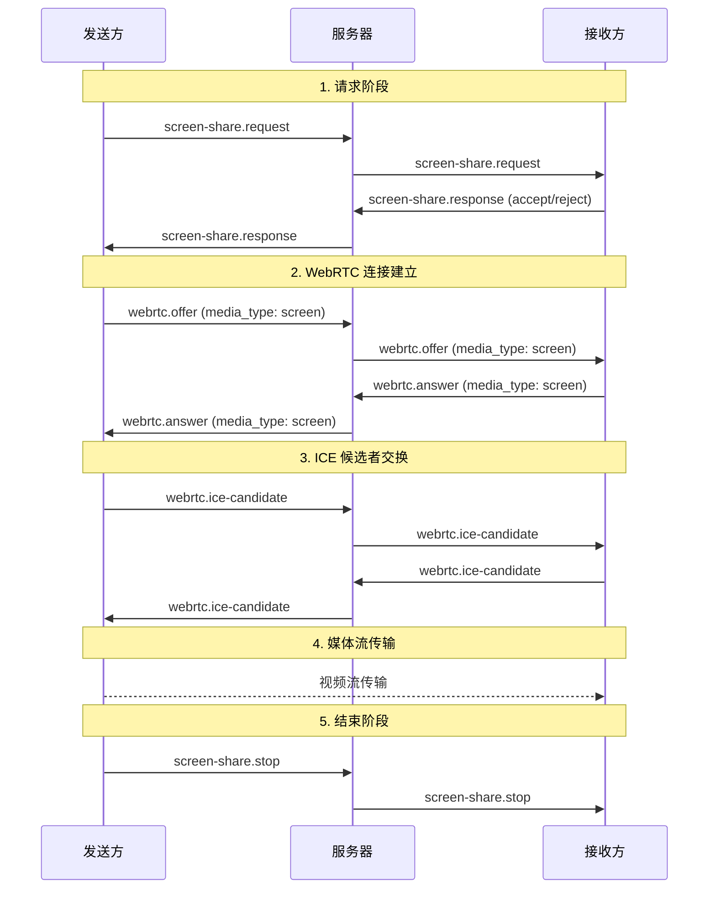
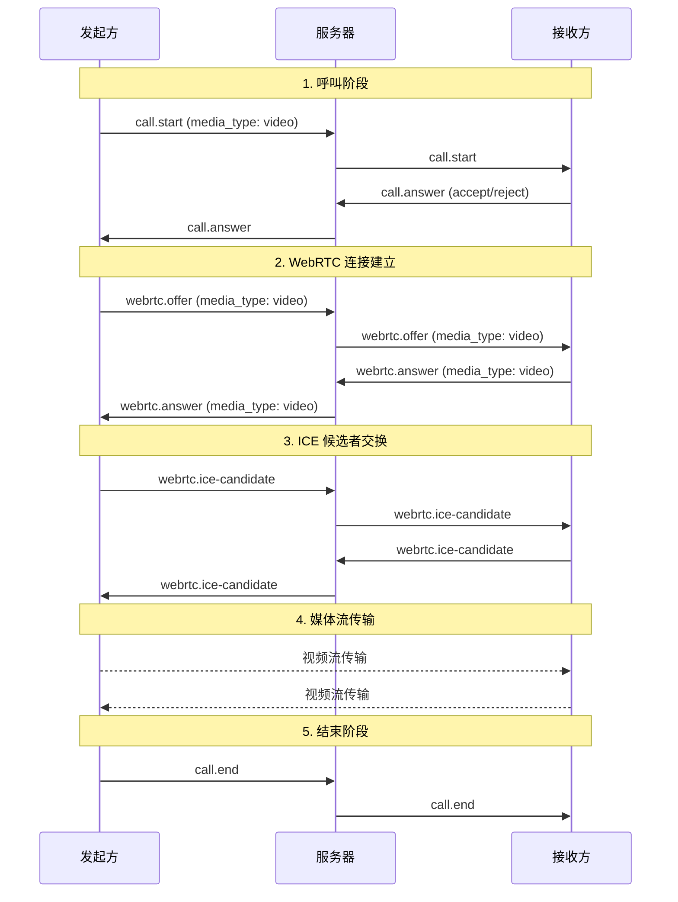

# 实时通信信令流程

## 概述

本文档描述了实时通信（屏幕共享、视频通话、语音通话）的信令流程。

## 信令流程图

### 屏幕共享流程



### 视频通话流程



## 消息格式

### 业务层消息

#### screen-share.request

```typescript
{
  type: 'screen-share.request',
  data: {
    target_user_id: number,
    from_user_id: number,
    conversation_id: number
  }
}
```

#### screen-share.response

```typescript
{
  type: 'screen-share.response',
  data: {
    target_user_id: number,
    from_user_id: number,
    accepted: boolean
  }
}
```

#### screen-share.stop

```typescript
{
  type: 'screen-share.stop',
  data: {
    from_user_id: number
  }
}
```

#### call.start

```typescript
{
  type: 'call.start',
  data: {
    target_user_id: number,
    from_user_id: number,
    media_type: 'video' | 'audio'
  }
}
```

#### call.answer

```typescript
{
  type: 'call.answer',
  data: {
    target_user_id: number,
    from_user_id: number,
    accepted: boolean
  }
}
```

#### call.end

```typescript
{
  type: 'call.end',
  data: {
    from_user_id: number
  }
}
```

### 信令层消息

#### webrtc.offer

```typescript
{
  type: 'webrtc.offer',
  data: {
    target_user_id: number,
    from_user_id: number,
    media_type: 'screen' | 'video' | 'audio',
    signal: RTCSessionDescriptionInit
  }
}
```

#### webrtc.answer

```typescript
{
  type: 'webrtc.answer',
  data: {
    target_user_id: number,
    from_user_id: number,
    media_type: 'screen' | 'video' | 'audio',
    signal: RTCSessionDescriptionInit
  }
}
```

#### webrtc.ice-candidate

```typescript
{
  type: 'webrtc.ice-candidate',
  data: {
    target_user_id: number,
    from_user_id: number,
    media_type: 'screen' | 'video' | 'audio',
    candidate: RTCIceCandidateInit
  }
}
```

## 关键要点

1. **统一的媒体类型标识**
   - 使用 `media_type` 字段统一标识
   - 取值：`'screen'` | `'video'` | `'audio'`
   - 替代原来的 `share_type` 和 `call_type`

2. **消息路由**
   - 业务层消息：根据 `type` 前缀路由（`screen-share.*` 或 `call.*`）
   - 信令层消息：根据 `media_type` 字段路由

3. **服务器转发**
   - 服务器必须转发所有字段，包括 `media_type`
   - 不修改消息内容，只添加 `from_user_id`

4. **状态管理**
   - 业务层管理会话状态（idle, connecting, active, ended）
   - 信令层管理连接状态（disconnected, connecting, connected）
